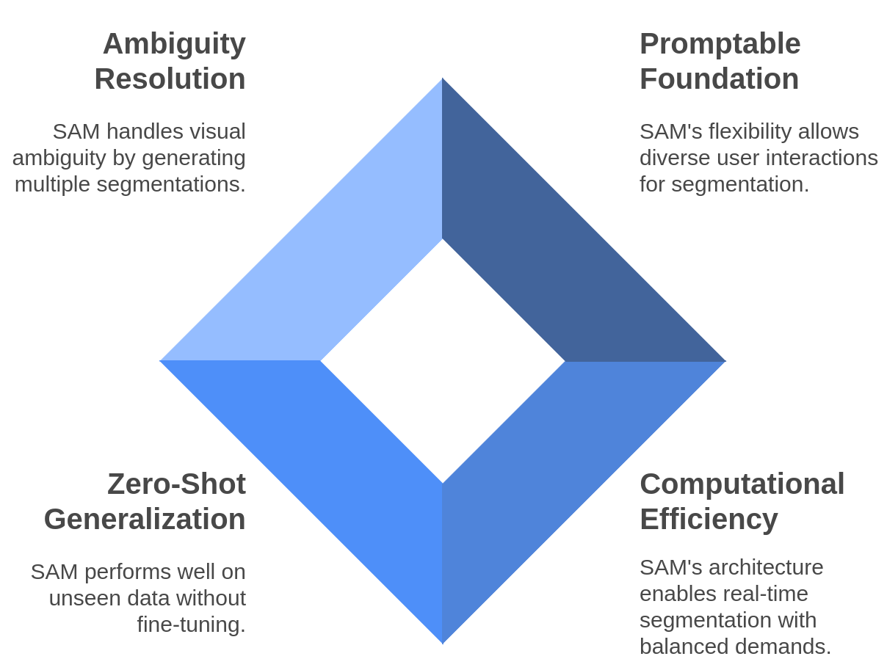
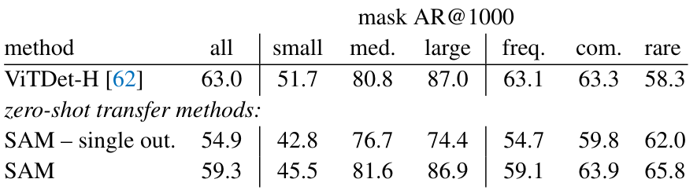

class: middle, center, title-slide
count: false

# Segment Anything

Kirillov et al. 2023

.center[.width-45[]]

Advanced Machine Learning

.footnote[Martin Dengis - Gilles Ooms]

---

class: middle

# Agenda

- Background Knowledge
- Paper Overview
- Promptable Segmentation Task
- Model Architecture
- Key Particularities
- Discussion

---
class: middle
count: false

# Background Knowledge

---
class: middle, has-header

## Segmentation

<!-- .center.stretch[
     
     
     
]

.footnote[Adapted from [Kirillov et al.](https://arxiv.org/abs/2304.02643), 2023] -->

# Segmentation is the task of partitioning an image, at the pixel level, into regions

???

Segmentation is the task of partitioning an image, at the pixel level, into regions.

Segmentation is crucial for various applications, including object detection, scene understanding, medical imaging, and autonomous driving. It helps in identifying and isolating objects of interest within an image, enabling further analysis or processing.

---
class: middle, section-indicator, has-header
data-section-name: "Segmentation"

## Segmentation

.center[
.width-100[

]
]

.footnote[Adapted from [v7labs](https://www.v7labs.com/blog/image-segmentation-guide).]

???

Image segmentation tasks can be classified into three groups based on the amount and type of information they convey.

While semantic segmentation segments out a broad boundary of objects belonging to a particular class, instance segmentation provides a segment map for each object it views in the image, without any idea of the class the object belongs to.

Panoptic segmentation is by far the most informative, being the conjugation of instance and semantic segmentation tasks. It gives us the segment maps of all the objects of any particular class present in the image.

---
class: middle, has-header

## Encoder-Decoder Architecture

.center[
.width-100[

]
]

.footnote[Credits: [CS231n, Lecture 11](https://cs231n.stanford.edu/slides/2018/cs231n_2018_lecture11.pdf), 2018.]

???

Encoder-decoder architectures form the backbone of many state-of-the-art image segmentation techniques, including the Segment Anything model proposed by Kirillov et al. from Meta. At a high level, these models consist of two key components:

Encoder: progressively reduces spatial resolution while capturing increasingly abstract and semantic-rich representations of the input image. This process, known as downsampling, typically employs convolutional layers with pooling or strided convolutions, extracting high-level features necessary for segmentation tasks.

Decoder: reconstructs a segmentation map by progressively restoring spatial resolution to match the original input dimensions. This upsampling step often uses techniques like transpose convolutions, interpolation methods, or learned deconvolutions to generate precise pixel-level predictions.

Together, the encoder-decoder framework allows models to efficiently integrate both global context (captured in low resolution) and local details (restored in high resolution), resulting in accurate and detailed segmentation outputs.

[Pointing to the Input Image (left side)]:
"Let's start from the left, where we have our original input image, represented with dimensions 3 × H × W—meaning three color channels (Red, Green, Blue), and spatial dimensions height (H) and width (W)."

[Moving to the Encoder section (red boxes)]:
"The next step involves the encoder, which performs downsampling. You can see the progressive reduction in the spatial dimensions as we move deeper into the network:

Initially, the resolution is reduced from H × W to H/2 × W/2, then further down to H/4 × W/4.

At each step, the encoder applies operations like convolution combined with pooling or strided convolutions to capture more abstract, high-level features, essential for understanding the context of the image."

[Highlighting the bottleneck (low-res representation)]:
"At the lowest point, we have the most abstract representation—also called the bottleneck, with significantly reduced dimensions (H/4 × W/4). Here, the network encodes high-level information necessary for segmentation but at the cost of losing spatial details."

[Moving to the Decoder section (blue boxes)]:
"To restore these spatial details and produce a segmentation map, the decoder then performs upsampling. It gradually increases spatial dimensions, returning first to H/2 × W/2 and eventually back to the original H × W resolution.

This step typically involves techniques like transpose convolutions or interpolation methods.

The decoder combines the high-level semantic information from the encoder with spatial details, enabling precise pixel-wise classification."

[Pointing to the Output Image (right side)]:
"Finally, we obtain our predicted segmentation map, where each pixel of the original image is classified into a specific class (here, the cow in front, another cow behind, the grass, and the background). The output resolution matches the input (H × W), allowing us to precisely locate each object's boundaries."

---
class: middle, has-header

## Zero-shot Learning

.center[
.width-100[

]
]

???

Definition:

Zero-shot learning (ZSL) is a machine learning technique where models are trained to recognize or classify objects they have never seen before. The model leverages its understanding of known classes to generalize to new, unseen classes without additional training.

Why Zero-Shot?

Limited Data: Annotating segmentation datasets is costly and time-consuming.

Unseen Categories: Useful for rare, novel, or newly identified objects.

Rapid Generalization: Quickly adapts to new semantic categories without explicit training.

How Does It Work in Image Segmentation?

Semantic Knowledge: Models use auxiliary information (text descriptions, attributes, embeddings) to understand unseen objects.

Transfer Learning: Pre-trained encoders (like Vision Transformers or CNNs) generate embeddings representing images in a high-dimensional semantic space.

Joint Embedding Space: Image embeddings are compared with semantic embeddings (e.g., text labels) to predict segmentation masks without direct examples.

---
class: middle, blue-slide
count: false

# Before diving into SAM's architecture

---
class: class: has-header

## Quick Demo

.center[
<video controls preload="auto" height="600" width="700">
  <source src="./figures/sam_demo.mp4" type="video/mp4">
</video>
]
---
class: middle

# Paper Overview

The paper's value proposition is organized around 3 core components:

1. The promptable segmentation **task**
2. A **model** to predict segmentation masks
3. A diverse and large-scale **dataset (SA-1B)**

All combined, they gave rise to the .bold[*Segment Anything Model (SAM)*] - .italic[i.e.,] the (self-pronounced) first *foundation model* for image segmentation.

???

- Focus only on first 2 points in details (time constraints)
- For the SA-1B dataset and data engine, see additional slides
- Foundation model = promptable pre-trained model, that offers powerful generalization capabilities, to be used in a standalone manner or composed with other models for downstream tasks

---
class: middle, has-header

## Promptable Segmentation Task

.center.width-65[]

- **What**: Generate valid segmentation masks for *any* prompt
- **Prompt Types**: Points & bounding boxes (*sparse prompts*), masks (*dense prompts*), text (PoC).
- **Validity**: Even *ambiguous* prompts should yield reasonable masks

.footnote[[Kirillov et al.](https://arxiv.org/abs/2304.02643), 2023]

???

The key idea here is to make segmentation interactive and universal.
Instead of needing a separate model for each segmentation task, the Segment Anything Model (SAM) introduces a unified task: given any prompt, the model should return a valid mask.

This prompt could be a point, a bounding box, a rough mask, or even a textual description—anything that gives a clue about what to segment.

This level of flexibility sets the foundation for a generalist segmentation model

---
class: middle, has-header

## Promptable Segmentation Task

.question[Why Promptable Segmentation?]

 

Adapting the *next-token prediction task* of NLP models to segmentation

1. naturally leads to **pre-training** as required for foundation models;
2. supports **zero-shot transfer**, .italic[i.e.,] adapting to new tasks via prompt engineering without requiring fine-tuning.

Finally, it also solves for ambiguity (more on that later).

???

Why create this promptable setup? Because it mirrors what’s been successful in NLP.

Think about models like GPT: they're trained to predict the next word, given a prompt. This task is general and flexible—it allows the model to be used for writing, summarization, translation, coding, and more. All through prompting.

Segment Anything adopts this idea: instead of building a model that does only one kind of segmentation, it trains a model to respond to prompts. This allows it to generalize—to be adaptable, like GPT.

Moreover, this design naturally supports pre-training at scale and zero-shot generalization—two crucial traits of foundation models.

And finally, SAM is designed to handle ambiguity. For example, if a user clicks on a shirt, SAM might return the shirt, the person, or both—because all are valid interpretations depending on the intent. The idea is that at least one plausible mask should be returned, even when the prompt is vague.

<!-- ---
class: middle, has-header

## From Promptable Task to Zero-Shot Transfer

**Pre-training phase**

- Train with sequence of prompts
- Learn to predict valid masks
- Develop prompt-mask associations

.pull-right[
**Zero-shot transfer**

- Design appropriate prompts
- Integrate with other models
- .italic[Example: Object detector → box prompt → segmentation]
]

???

In the pre-training phase, the model is exposed to a wide variety of prompts. It learns how to interpret them and generate valid masks in response. Importantly, it's not tied to any fixed class labels or datasets. Instead, it develops a general-purpose understanding of how to map prompts to masks.

Once this is learned, zero-shot transfer becomes possible.

For instance, you can pair SAM with another model—say, an object detector that detects people. That detector produces bounding boxes, and SAM uses those boxes as prompts to segment the people.

This modularity and generalization are what allow SAM to be used across unseen tasks and datasets without fine-tuning. -->

<!-- ---
class: middle, has-header

## Relation to Existing Tasks

- **Interactive segmentation**: SAM must produce valid masks with minimal guidance

- **Difference from multi-task models**: Not trained/tested on fixed task set

- **Composable with other models**:
  - Object detector + SAM = Instance segmentation
  - Text model + SAM = Text-guided segmentation
  - Manual clicks + SAM = Interactive segmentation

???

Slide is more for reference → skip it!

Here we draw connections between SAM and existing segmentation paradigms.

First, interactive segmentation: SAM is built to be used interactively. A user can click on an image, and SAM will instantly return a mask. This is possible because the model runs in real time (∼50ms per prompt) and doesn't require retraining for each input.

Second, SAM differs from typical multi-task models, which are trained on a fixed set of segmentation tasks and cannot generalize beyond that. SAM is not trained for specific classes—it's trained to respond to prompts, which makes it task-agnostic.

Finally, SAM is composable. That means it can be plugged into larger systems:

Combine it with an object detector to do instance segmentation.

Pair it with a text model to enable text-guided segmentation.

Let a human provide input (like clicks), and you have an interactive tool.

This composability is key to its usefulness in practical systems. -->

---

class: middle

# SAM Architecture

.center.width-65[]
.center.italic[High-level Overview of SAM]

.footnote[[Kirillov et al.](https://arxiv.org/abs/2304.02643), 2023]

---
class: middle, has-header

## Image Encoder

- **Base Architecture**: Vision Transformer (ViT-H/16) pre-trained on MAE*
- *Enhancements*:
  - 14×14 windowed attention + 4 global attention blocks
  - Input resolution: 1024×1024 (rescaled and padded from original)
- *Output*:
  - 16× downscaled embedding (64×64)
  - Channel dimension reduced to 256 via convolutions   (each followed by Layer Normalization)

.center.width-85[]

.footnote[Adapted from [Kirillov et al.](https://arxiv.org/abs/2304.02643), 2023]

???

Vision Transformer (ViT-H/16) Pre-trained with MAE

- **ViT-H/16**:
  - "ViT" refers to **Vision Transformer**
  - "H" stands for **Huge**
  - "16" means the model **divides images into 16×16 patches** before processing.

- **Pre-trained with MAE***:
  - **MAE (Masked Autoencoder)** is a **self-supervised learning** method.
  - It **masks** random patches of an image and trains the model to **reconstruct** them.

- Windowed attention: local self-attention on a 14x14 subimage
- 4 global attention blocks: for global context

---

class: top, has-header

## Prompt Encoder

### Sparse Prompts (points & boxes)

- *Points*: positional encoding + learned embedding (foreground/background)
- *Boxes*: two points (top-left, bottom-right) with positional encoding
<!-- - Text: CLIP text encoder (proof-of-concept) -->

### Dense Prompts (*masks*)

- Input at 1/4 resolution of image (256×256)
- Downscaled 4× via convolutions to 64×64
- Element-wise addition to image embedding

.center.width-85[]

.footnote[Adapted from [Kirillov et al.](https://arxiv.org/abs/2304.02643), 2023]

???

- Mask is basically another image: so we encode then add to the existing image embedding
- The multi-modal prompt encoder is what makes SAM so flexible. By converting different types of prompts into a common embedding space, the model can adapt to various input modalities.
-
- Text prompts: CLIP text encoder (proof-of-concept)

---
class: middle, has-header

## Mask Decoder

- **Process**:
  1. Image embedding (64×64, 256-dimensional)
  2. Prompt embeddings as tokens
  3. Self-attention among tokens
  4. Cross-attention between tokens and image embedding
  5. Point-wise MLP updates each token
  6. Cross-attention from image to tokens
- **Upsampling**: 4× via transposed convolutions

.center.width-85[]

.footnote[[Kirillov et al.](https://arxiv.org/abs/2304.02643), 2023]

???

- The mask decoder is deliberately kept lightweight since it needs to run multiple times during interactive segmentation.
- The token embeddings are padded with **output tokens**, which are subject to the same processing workflow for them to acquire semantic information about the image and the prompts!

---
class: middle, has-header

## Handling Ambiguity

.red[Problem]: Single prompts often have multiple valid interpretations
.green[Solution]:

 

.width-95[]
.center.italic[Predict *multiple masks* simultaneously (default: 3)]

.footnote[[Kirillov et al.](https://arxiv.org/abs/2304.02643), 2023]

???

Naive approach: Averaging over multiple possible interpretations... but it would create blurry, invalid masks

---
class: middle, has-header
count:false

## Handling Ambiguity

.red[Problem]: Single prompts often have multiple valid interpretations
.green[Solution]:

 

.center.stretch[]
.center.italic[Use *IoU* prediction head to rank masks]

.footnote[[Kirillov et al.](https://arxiv.org/abs/2304.02643), 2023]

---
class: middle
count: false

# Key Particularities

---
class: middle, has-header

## Promptable architecture

- **Foundation model approach**: Trained on vast, immense dataset and can fulfill a broad range of general tasks
- **Flexible input prompts**: Handles single points, multiple points, bounding boxes, rough masks
- **Ambiguity resolution**: Uses prompt ensembles to disambiguate when multiple valid segmentations exist
- **Prompt engineering**: Different prompt combinations yield different valid segmentation results
  - the criticality thereof is maybe not highlighted enough in the paper

???

SAM embodies the foundation model approach through its versatile promptable architecture, trained on massive datasets to handle diverse segmentation tasks with remarkable flexibility. The model accepts various input prompts—from single points to bounding boxes and rough masks—and intelligently handles ambiguity through prompt ensembles when multiple valid segmentations exist. While the paper demonstrates how different prompt combinations yield different segmentation results, it somewhat understates the critical importance of prompt engineering in practical applications, which becomes essential when guiding the model toward specific interpretations in complex scenes.

---
class: middle, has-header

## Dissociated Encoders

.center.width-85[]

- **Computational efficiency**:
  - Heavy image embedding computation performed once and cached
  - Lightweight prompt processing enables real-time interaction
  - Allows for multiple segmentations without re-encoding the image

???

- **Two-stage architecture**:
  - Image Encoder: Vision Transformer (ViT) converts images to embeddings
  - Prompt Encoder: Processes various prompt types
  - Mask Decoder: Fuses information at runtime with attention mechanisms

- The separation of image and prompt encoding is key to SAM's interactive capabilities
- Image processing happens just once (taking ~0.15 seconds on GPU) while prompt processing is extremely fast (~0.55ms on web-browser = CPU)
- This design enables interactive applications where users can rapidly provide different prompts

---
class: middle, has-header

## Training Algorithm

.center.width-100[
   
  ]

???

SAM, employs a sophisticated training methodology designed to simulate interactive segmentation. This approach develops a robust foundation model capable of handling diverse and complex segmentation tasks.

Training Phases:

Initial Prompt Phase (Iteration 1):

The process begins with an initial prompt, which is either a random foreground point (85% probability) or a bounding box around the target object (15% probability).
This initial prompt serves as the starting point for the model to generate its first mask prediction.
Error-Guided Refinement Phase (Iterations 2-9):

In these iterations, the model computes error maps by comparing the predicted mask with the ground truth.
It identifies false negative (FN) and false positive (FP) pixels, which represent areas where the prediction deviates from the ground truth.
An adaptive sampling probability is calculated to decide whether to focus on FP or FN pixels. This probability is biased towards FN pixels to ensure the model captures all relevant parts of the object.
For FN pixels, the model uses techniques like the maximum distance transform to select the most informative points, which are then added to the prompt set.
This iterative process allows the model to learn from its mistakes and progressively improve the segmentation mask.
Mask-Only Refinement Phase (Iterations 10-11):

In the final iterations, the model uses the previously predicted mask as the sole prompt, without adding new points.

This phase emphasizes autonomous refinement, teaching the model to improve its predictions without additional human guidance.
It helps the model generalize and adapt, even when initial predictions are poor

---

class: middle, has-header

## Losses

- **Focal Loss:** $$FL(p_t) = -\alpha(1 - p_t)^\gamma \log(p_t) \quad \quad $$
.smaller-xx[(from Lin et al. 2018)]

- **Dice Loss:**
  $$DL(P, G) = 1 - \frac{2 \sum_i^N p_i g_i}{\sum_i^N p_i^2 + \sum_i^N g_i^2}$$
  .smaller-xx[(from Milletari et al. 2016)]

- **Combined in 20:1 ratio**:
$$\mathcal{L} = 20 \cdot FL + DL$$

- **Ambiguity handling**: Backpropagates only from lowest-error mask prediction

???

The training of SAM is guided by a combination of loss functions designed to address the challenges of image segmentation, particularly the imbalance between foreground and background pixels.

**Focal Loss:**
with $\gamma = 2.0, \alpha = 0.25$

- Focal Loss is designed to address the severe class imbalance between foreground and background pixels.
- It modifies the standard cross-entropy loss to down-weight easy examples and focus on challenging ones, making it class-agnostic.
- This helps the model pay more attention to boundary errors and other difficult regions.

**Dice Loss:**

- Dice Loss optimizes the direct overlap between the predicted and ground truth masks.
- It is less sensitive to class imbalance compared to pixel-wise losses and encourages better boundary prediction.
- Dice Loss directly optimizes the Intersection over Union (IoU), ensuring high-quality masks.

**Combined Loss:**

- The total loss is a linear combination of Focal Loss and Dice Loss, with a 20:1 ratio.
- This combination balances pixel-level and mask-level quality, ensuring that the model produces accurate and precise segmentation masks.

**Ambiguity Handling:**

During training, the model backpropagates only from the lowest-error mask prediction.
This approach helps the model handle multiple valid interpretations and reduces ambiguity in the segmentation process.

<!-- ---
class: middle, has-header

## Zero-shot learning

.center.width-100[]

???

- **Domain generalization**:
  - Trained on diverse dataset of 11M images and 1.1B masks
  - Performs well on unseen domains without fine-tuning
  - Demonstrates strong performance across medical, satellite, and specialized imagery

- **Task adaptation**:
  - Functions as foundation for downstream tasks without task-specific training
  - Can be applied to object detection, instance segmentation, semantic segmentation
  - Adaptable to video segmentation with minimal modification

- **Limitations**:
  - Performance varies by domain distance from training distribution
  - Struggles with highly specialized imagery without additional prompting -->

---
class: middle, has-header

## Zero-shot learning

SAM was evaluated on several **zero-shot transfer** experiments to demonstrate its generality beyond promptable segmentation.

1. Single-Point Mask Prediction
2. .bold[Edge Detection]
3. Object Proposals
4. Instance Segmentation
5. .bold[Text-to-Mask] (Proof of Concept)

- **Evaluation Context:** Impressive results but comparative analysis against other models is sometimes a bit dubious

???

SAM demonstrated impressive zero-shot transfer capabilities across multiple tasks without any fine-tuning.
- For **Single-Point Mask Prediction**, SAM was compared against interactive segmentation models like RITM and SimpleClick on the DAVIS dataset, achieving competitive results despite not being specifically designed for this purpose.
- In **Edge Detection**, SAM was evaluated against specialized edge detectors like HED and Canny on the BSDS500 benchmark. Using point-grid prompts at varying densities, SAM outperformed these dedicated edge detectors, reaching state-of-the-art performance with optimal grid spacing.
- For **Object Proposals**, SAM was benchmarked against MCG on the COCO dataset, where it generated high-quality masks that achieved better average recall, particularly excelling on rare object categories. This comparison involved generating a fixed number of mask proposals per image and evaluating their coverage of ground truth objects.
- In **Instance Segmentation**, SAM was evaluated on COCO against fully supervised methods like Mask R-CNN. While not matching supervised approaches, SAM achieved over 46% AP at IoU 0.5 without any COCO-specific training, showcasing its strong generalization capabilities.
- The **Text-to-Mask** experiment combined SAM with CLIP to enable textual prompting. This proof-of-concept demonstrated that SAM could be integrated with text models to generate masks for objects described in natural language, expanding its accessibility to non-visual prompts.

---
class: middle

# Discussion

---
 

- **Generalization Capability:** Strong performance across domains without retraining *.italic[(... really?)]* $^1$

.footnote[[1] : ([Ali et al.](https://www.sciencedirect.com/science/article/pii/S0895611124001502), 2025)]

---
count:false
 

- **Generalization Capability:** Strong performance across domains without retraining *.italic[(... really?)]* $^1$
- **Compositionality:** Real-time interaction is possible...
  - but initial encoding remains computationally expensive, limiting deployment options
  - may limit the compositionality put forward

.footnote[[1] : ([Ali et al.](https://www.sciencedirect.com/science/article/pii/S0895611124001502), 2025)]

---
count:false
 

- **Generalization Capability:** Strong performance across domains without retraining *.italic[(... really?)]* $^1$
- **Compositionality:** Real-time interaction is possible...
  - but initial encoding remains computationally expensive, limiting deployment options
  - may limit the compositionality put forward
- **Object Precision:** Handles common objects well but struggles with small or thin structures requiring domain-specific solutions

.footnote[[1] : ([Ali et al.](https://www.sciencedirect.com/science/article/pii/S0895611124001502), 2025)]

---
class: middle, has-header

## The Big Picture

- Meta is a company with plenty of resources
- While they advocate for open-sourcing everything (e.g., *SA-1B* is a big contribution in that sense), they most potentially also have a political agenda to serve
- SAM as the ".italic[first foundation model for segmentation]" is heavily emphasized. *Why is that?*
.pull-right[
$\Rightarrow$ Segmentation is a hot-topic right now
- from self-driving cars
- to Meta's push towards mixed augmented reality
  - SAM2 (video-enabled) was released recently, which supports the point!
]

???
<!-- ---
class: middle, has-header

## Conclusion

.center.width-100[]

???

SAM's impact extends beyond academic research, enabling new applications in medical imaging, autonomous systems, content creation, and data annotation. By dramatically reducing the barriers to high-quality segmentation, SAM democratizes access to capabilities previously requiring significant expertise and computational resources.

As foundation models continue transforming computer vision, SAM stands as a powerful example of how scale, architectural innovation, and thoughtful training methodology can create systems with remarkable generalization capabilities. The future of segmentation will undoubtedly build upon SAM's contributions, further bridging the gap between human visual understanding and computer vision systems. -->

---
class: middle, center

# Thank you for your attention

---
class: middle, black-slide, center
count: false

# Additional Slides

---
class: middle
count: false

<!-- Additional Slides -->
# IoU Score

.center.width-85[]
.center.italic[Intersection over Union (~confidence score)]

.footnote[[IdiotDeveloper](https://idiotdeveloper.com/what-is-intersection-over-union-iou/), 2023]
---
class:middle, has-header
count:false

## IoU Score .italic[Estimates]

.center.stretch[]

.center[MLP for IoU works on an additional output token!]

.footnote[[Kirillov et al.](https://arxiv.org/abs/2304.02643), 2023]

---
class: middle
count: false

<!-- Additional Slides -->
# SA-1B Dataset and Data Engine

---
class: middle, has-header
count: false

##  SA-1B

.center.stretch[
     
     
     
]

$11$ million images and over $1.1$ billion segmentation masks.

.footnote[Adapted from [Kirillov et al.](https://arxiv.org/abs/2304.02643), 2023]

???

Diversity: The dataset is geographically diverse, covering images from various regions and economic groups. This diversity is intended to support the development of more equitable and fair models.

Privacy Considerations: To protect privacy, faces and vehicle license plates in the images have been blurred. The dataset is released under a license that restricts attempts to identify individuals.

Purpose: The primary goal of SA-1B is to serve as a comprehensive resource for training and evaluating segmentation models, particularly those designed for zero-shot learning and generalization to new tasks and datasets.

---
class: middle, has-header
count: false

##  Data Engine

.flex-container[
  .flex-left[
    
  ]

  .flex-right[
    <ol style="margin-left: 20px; margin-top:150px; padding-left: 0;">
      <li>Assisted-Manual Stage</li>
      <li>Semi-Automatic Stage</li>
      <li>Fully Automatic Stage</li>
    </ol>
  ]
]

???

**Assisted-Manual Stage:**
- In this stage, professional annotators manually labeled masks by clicking foreground/background points using an interactive segmentation tool powered by SAM.
- The goal was to annotate objects freely, without semantic constraints, focusing on both "stuff" and "things."
- Annotators were encouraged to label prominent objects first and move to the next image if annotation took too long.

**Semi-Automatic Stage:**

- This stage aimed to increase the diversity of masks by focusing annotators on less prominent objects.
- SAM automatically generated confident masks for a subset of objects, and annotators labeled additional unannotated objects.
- This approach increased the number of masks per image and improved the model's ability to segment a wide range of objects.

**Fully Automatic Stage:**

- In the final stage, annotation was fully automated. SAM generated masks without human input by prompting the model with a regular grid of foreground points.
- The model predicted multiple valid masks for each point, and confident masks were selected based on stability and non-maximal suppression.
- This stage produced the majority of the masks in SA-1B, ensuring high quality and diversity.

---
class: middle
count: false

<!-- Additional Slides -->
# SAM's Implementation Details

- **Optimizer**: AdamW with weight decay of 0.1 and parameters $(\beta_1 = 0.9\), \(\beta_2 = 0.999\)$.
- **Learning Rate**:
  - Initial learning rate of $8e-4$ after a linear warmup of $250$ iterations.
  - Cosine decay schedule with step-wise reductions at $60k$ and $86,666$ iterations by a factor of $10$.
- **Gradient Clipping**: Applied at a norm of $0.01$ to stabilize training.
- **Mixed Precision Training**: Utilized to optimize computational efficiency and memory usage.
- **Data Augmentation**:
  - Extensive augmentation techniques including random resizing, cropping, and flipping.
  - Large-scale jitter with a scale range of $[0.1, 2.0]$ when training data is limited.

---
class: middle
count: false

<!-- Additional Slides -->
<!-- # SAM's Implementation Details (2/2) -->

- **Regularization**:
  - Drop path applied with a rate of $0.4$.
  - Layer-wise learning rate decay of $0.8$.
- **Batch Size**: $256$ images distributed across $256$ GPUs.
- **Image Encoding**:
  - Specialized caching system to amortize image encoding costs.
  - Training with up to 64 randomly sampled masks per GPU to manage memory usage.
- **Initialization**: Pre-trained from an MAE ViT-H model.
- **Training Duration**: $90k$ iterations, equivalent to approximately $2$ epochs over the SA-1B dataset.

---
class: middle, has-header
count: false

## Vision Transformer

Backbone of the image encoder

.center.width-100[]

.footnote[[Dosovitskiy et al.](https://arxiv.org/abs/2010.11929), 2020]

---
class: middle
count: false

<!-- Additional Slides -->
# Zero Shot Learning Results

---
class: middle, has-header
count: false

## Zero-Shot Single Point Valid Mask Evaluation

.center.width-100[]

.footnote[[Kirillov et al.](https://arxiv.org/abs/2304.02643), 2023]

???
Single-Point Mask Prediction: This experiment tests if SAM can generate a complete object mask when given just a single point click inside the object. It's similar to how someone might click on an object in Photoshop and expect the whole object to be selected. SAM was compared against interactive segmentation models like RITM and SimpleClick on the DAVIS dataset, achieving competitive results.

---
class: middle, has-header
count: false

## Zero-Shot Edge Detection

.center.width-100[]

.footnote[[Kirillov et al.](https://arxiv.org/abs/2304.02643), 2023]

???

Edge Detection: This experiment evaluates SAM's ability to identify boundaries between objects or regions in an image - essentially finding where one object ends and another begins. Using point-grid prompts at different densities, SAM outperformed specialized edge detectors like HED and Canny on the BSDS500 benchmark.

---
class: middle, has-header
count: false

## Zero-Shot Object Proposals

.center.width-100[]

.footnote[[Kirillov et al.](https://arxiv.org/abs/2304.02643), 2023]

???

Object Proposals: This test examines SAM's capability to automatically suggest potential objects in an image without specific prompting. The system generates multiple mask suggestions per image, which is useful for downstream tasks like object detection. SAM outperformed MCG on the COCO dataset, showing better average recall, especially for uncommon object categories.

---
class: middle, has-header
count: false

## Zero-Shot Instance Segmentation

.center.stretch[
     
     
]

.footnote[[Kirillov et al.](https://arxiv.org/abs/2304.02643), 2023]

???

Instance Segmentation: This experiment tests if SAM can identify and create separate masks for individual objects of the same class (like separating each person in a crowd). While not matching fully supervised methods like Mask R-CNN, SAM achieved over 46% AP at IoU 0.5 on COCO without any specific training.

---
class: middle, has-header
count: false

## Zero-Shot Text-to-Mask

.footnote[[Kirillov et al.](https://arxiv.org/abs/2304.02643), 2023]

???

Text-to-Mask: This proof-of-concept demonstrates the integration of SAM with text models like CLIP, allowing users to describe an object in words (e.g., "the red car") and have SAM generate the appropriate mask. This expands SAM's usefulness beyond visual prompts to language-based interactions.

---
class: middle
count: false

<!-- Additional Slides -->
# SAM 2

---
class: middle, has-header
count: false

## Video

.center[
<video loop controls preload="auto" height="600" width="600">
  <source src="./figures/sam2.mp4" type="video/mp4">
</video>
]